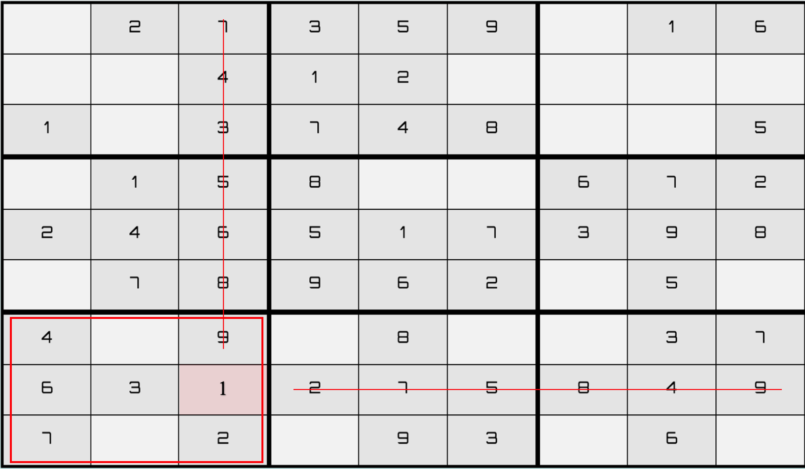
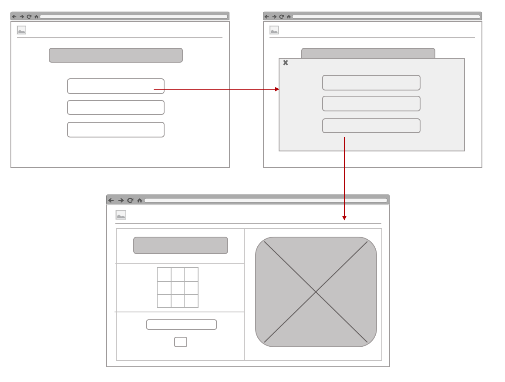

# Sudoku-Game

Sudoku is a puzzle game designed for a single player. Grid of cells filled with numbers (1-2-3-4-5-6-7-8-9), stacked nine high and nine wide.

## Description

The project game is to fill a 9x9 grid so that each column, each row, and each of the nine 3x3 regions contains the digits from 1 to 9. The player need to find missing number by scan rows, columns and regions to figure out where is only one legal place for that number. It's help for improves memory and logic when it used for memorize the numbers.

**Strategy to play:**

There are two main techniques one can use to solve a sudoku puzzle
- Crosshatching
scan for empty cells to find the number can only appear once in any row, column or region.
- Counting.
by count all the different numbers that's in a row,column and region that connects to one cell.



### Technical Used

```
HTML
CSS
JavaScript
jQuery
BootStrap
VS code
SweetAlert
animate.css
```

### Wireframes

Step1:
Design the pages 


Step2:
writing the pseudo code in a way that will translated into a programming language

Step3:
Coding !!

Step4: 
Debug and test the pages

### User Stories

As prerequisite of software engineering immersive course -Misk for developing a complete project using the technologies taught in previous weeks:
Day1:
- Sketch and desing the pages style
-Write the pseducode and the logic to solve the problem
-Design the HTML page
-Write the JavaScript code and runing the functionality of the game
Day2:
-Create the CSS style sheet for the web page
Day3:
-Add levels to game, timer, alert and animations
-Debug and run the page for checking 
-Complate the CSS design

## Planning and Development Process

A basic story of your planning and developing this project.

### Problem-Solving Strategy

The approach used to solve the problems faced during write the code was at each line of code that assign, retrieve or store value printing it in console log and inspect it's result using the developer tools provided by google chrome. Also using alert() in conditional situation.

### Unsolved problems

- saving the user progress and the ability of resuming the game.
- generate new grid randomly
- add the ability of making notes in cells


## Acknowledgments

Working in this project has been a pleasurable and enriching experience, and I would like to thank GA who have been helped me to get this knowledge and make me have the ability to do such a project

---

 ## References
 ```
 https://getbootstrap.com/
 https://jquery.com/
 https://sweetalert2.github.io/

 ```
